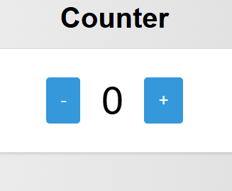

<h1 align="center">Counter App: a Start2Impact project</h1>
<h3 align="center">This is a simple web application developed in JavaScript that serves as a counter. The user initially sees the value 0 and can increment or decrement it by clicking the "+" and "-" buttons.</h3>

  

## ⭐️ Show Your Support

If you find this code helpful or interesting, please consider giving us a star on GitHub. Your support helps promote the project and lets others know that it's worth checking out. 
Thank you for your support! 🌟

## 🗺 Project Structure
<ul>
  <li><b>index.html:</b> Main HTML file.</li>
  <li><b>css/style.css:</b> CSS file for application styling.</li>
  <li><b>js/counter.js:</b> JavaScript file for logic and DOM manipulation.</li>
</ul>

## 🙌 Functionality
<ul>
<li>Initial display of the counter at 0.</li>
<li>Buttons to increment and decrement the value.</li>
<li>Dynamic DOM manipulation to create and manage elements.</li>
</ul>

## 🖥️ Execution Instructions
<ul>
<li>Clone the repository. Link: <strong>https://jpier34.github.io/Counter/</strong></li>
<li>Open the <b>index.html</b> file in a <b>browser.</b></li>
<li>Use the buttons to change the <b>counter value.</b></li>
</ul>

## 📜 Notes
<ul>
<li>The project is built without the use of jQuery or other frameworks.</li>
<li>The logic is divided into functions for better code maintainability.</li>
<li>100% responsive for all devices.</li>
</ul>
